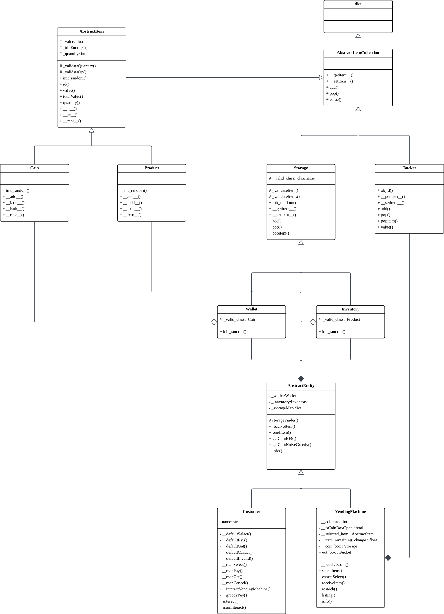

# Problem Outline

The school is considering adding vending machines to the school campus, as it would not only allow students to stay refreshed between classes, but also provide an extra source of income for the institution. The school, interested in the profitability of vending machines, would like to know how well such a system would perform through a simulation modeling how students would interact with the vending machines. However, simulations of such systems, involving complex interactions between entities and entities in the system, as well as the flow of items and coins will be hard to model without an organized foundational architecture. Therefore, we need an extensible framework capable of processing these interactions in a clean and structured manner that can be easily built upon, and one that is hopefully performant too.

# Success Criteria

The success criteria for this project is based on: 
- Similarity to real life: Project needs to be able to simulate the interactions between vending machines and consumers, which can be broken down into the following parts: 
    - Object Permanence: Objects don’t disappear from the system unpredictably
    - Inventory Management: Items are able to be stored and managed by entities in the system (ie customers and vending machines)
    - Transaction Cycles:  Entities are able to interact with each other in a way that modelizes real world transactions. 
- Codebase: 
    - System Robustness: Project does not crash due to user input
    - Performance: Project needs to be able run in a timely fashion, 
    - Extensibility: Project is able to extend its features without complete system redesigns and has many tools to help developers (errors, useful methods and classes, etc…)

# Plan

We need to create an object oriented framework able to simulate the interaction between students and vending machines, and how items and coins are transferred in this system. 

Overall, the project is quite simple and straightforward, therefore only around 8 hours is needed to complete the project

| Time | Task   |
| :----- | :----- |
| 1 hrs | Architecture Planning |
| 2 hrs | Writing entities and inventory management system |
| 2 hrs | Writing Transaction cycle |
| 1 hr  | Testing |
| 2 hrs | Polish and documentation |

# Code 

## Techniques

The programming and OOP techniques employed by this project are chosen to create an extensible, structured, and performant system that lays the groundwork for future simulations to be built upon.   
Composition and aggregation are the most important aspects of the project as the relationships they describe provides an intuitive way to simulate how real world items and entities interact with each other in an extensible manner. While composition improves code flexibility by loosely coupling `Storage` objects to a parent `AbstractEntity` while mimicking inalienable aspects of an entity; Aggregation `Storage` aggregates objects of classes derived from `AbstractItem` to model how items are stored and transferred in real life, since the lifetime of the objects contained in the storage are not confined within the `Storage` or its parent Entity. These designs also offer new features or entity types to be added in the future with minimal disruption to the existing architecture.  The project also uses encapsulation heavily as modularization is important for extensible code; therefore, methods and attributes need to be separated into into private, protected and public visibilities to provide clean interface that prevents, as well, accidental changes to important attributes and ensuring data integrity through data validation comes with these interfaces. Abstraction is also used, such as in the abstract base classes `AbstractEntity` or `AbstractItem`, used to define a common interface for its inherited subclasses, `Customer` and `Coin`, to override. This abstraction allows common behaviors among subclasses to be duck typed, such as for receiving and sending objects, further improving code reusability.  The choice of data structures answers to the needs of speed and memory for their usages: Inheriting from dictionaries for `Storage` allows O(1) lookups for item access, providing constant lookup times that don't scale with size. Lookup tables store constant product data compactly, and the BFS algorithm employs a queue and a visited-state dictionary to explore these combinations systematically.   
The choice to use BFS and greedy as the algorithms responsible for choosing coins was made according to the opportunity cost between their ease of implementation versus the loss in performance compared to a more performant solution, in the context of an interaction between a student and vending machine. Whilst a more optimal solution that uses a dynamic programming approach for a bounded knapsack problem could improve time complexity from an exponential O(2^n) to a polynomial time complexity Considering the scope of the scenario, such optimizations would be redundant . 

## Test Cases

| Test Cases                                      | Expected Behavior                                                                                                        |
| :---------------------------------------------- |:----------------------------------------------------------------------------------------------------------------------- |
| Normal behavior (Control Test)                  | `tests/basic.py`:  Tests whether the project is able to simulate successful transaction cycles. Expects vending machine to receive coins from a single customer and return the correct item and change after enough money was received |
| Manual testing                                  |  `tests/manual.py`: |
| Purchasing without sufficient money             | `tests/no_money`: Tests how project would handle the edge case where a consumer does not have enough money to pay for their purchase. Expects customer to cancel when they realize they are not able to afford the price |
| Paying to vending machine without enough change | `tests/no_change.py`: Tests how project would handle the edge case where vending machine needs to return a change but does not have enough money to do so. Excepects vending machine to cancel the order and return the coins received |
| Interacting with a vending machine with no stock | `tests/no_stock.py`: Tests how project would handle the edge case when a vending machine that has no more products to sell. Expects blank menu that is uninteractable to consumers |
| Multi-consumer paying                           | `tests/splitbill.py`: Tests project's ability to simulate successful transactions cycles where one or multiple people pay for a purchase. Expects vending machine to successfully handle coins from multiple sources and return the correct item and change after enough money was received |

# Evaluation

The project passes all test cases, demonstrating it is able to match the success criteria described earlier. However, improvements can still be made. Most notably in code documentation, the time complexity of choosing coins to give can be improved from the exponential complexity present in the BFS algorithm currently used, to the more optimal polynomial complexity of the dynamic approach solution discussed previously, and improved support for automatic decision making
